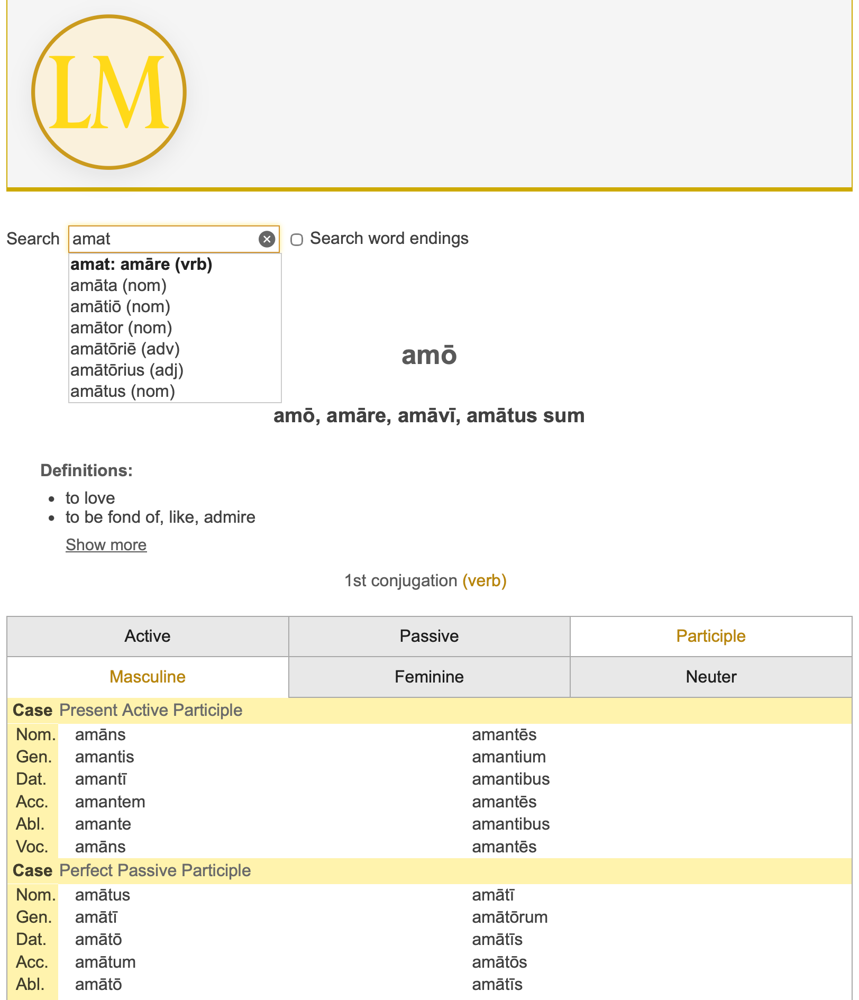

# LexiconMeum

A Latin dictionary and grammar lookup tool.

_Vanilla JavaScript single-page app backed by a Spring Boot REST API._

---

## Features

- **Easy lookup** — autocomplete search by prefix or suffix; find a word by any of its inflected forms.
- **Word meanings** — comprehensive definitions sourced from [Wiktionary](https://www.wiktionary.org).
- **Complete inflection tables** — full inflections laid out for comparison, with your searched form highlighted.
- **Grammatical detail** — additional information such as gender and governed case.

---

## Getting Started

This is the frontend only; it talks to a separate Spring Boot backend (see below).

### Prerequisites

- Node.js (v18+ recommended)
- A running backend (see [lexiconmeum](https://github.com/annedyne/lexiconmeum))

### Running Locally

1. Clone the repo
2. Install dependencies: `npm install`
3. Start the dev server: `npm run dev`
4. Ensure the backend is running at the URL configured in `.env.development` (VITE_API_BASE_URL). By default:
   `http://localhost:8085/api/v1`

---

## Testing

- Run all tests: `npm test`
- Watch mode (re-run on file changes): `npm run test -- --watch`
- Run a specific file: `npx vitest run path/to/file.test.js`
- If a test needs a DOM (browser-like) environment: `npx vitest --environment jsdom`

Tests are located in the `test/` directory.

---

## Configuration

API base URL is set per environment via `VITE_API_BASE_URL` in root `.env` files
(loaded automatically by Vite based on mode):

- `.env.development` — `http://localhost:8085/api/v1` (used by `npm run dev`)
- `.env.production` — `/api/v1` (used by `npm run build` / `preview`)

---

## Deployment

When ready for production:

- Build the app with Vite: `npm run build` (outputs to `dist/`)
- Deploy the contents of `dist/` to a static host (Netlify, Vercel, S3, etc.)
- Configure the production API base URL via `.env.production` (VITE_API_BASE_URL), not a config.js file

## Backend

This frontend talks to a separate Spring Boot backend:
[github.com/annedyne/lexiconmeum](https://github.com/annedyne/lexiconmeum).
Runs at `http://localhost:8085` by default — see that repo for setup.

### API Contract

- The frontend relies on these endpoints:
    - `GET /api/v1/lexemes/autocomplete/prefix?prefix=<string>`
      Response: JSON array of matching words (e.g., `["amare", "amatus"]`)

    - `GET /api/v1/lexemes/autocomplete/suffix?suffix=<string>`
      Response: JSON array of matching words (e.g., `["amaturus", "amonibus"]`)

    - `GET /api/v1/lexemes/{id}/detail`
      Response: JSON object of word definitions and inflections